<div align="center">

<picture>
  <source media="(prefers-color-scheme: dark)" srcset="banner-dark.svg">
  <source media="(prefers-color-scheme: light)" srcset="banner-light.svg">
  
</picture>

</div>

---

<div align="center">

**`Founder @ Kepll LTD`** &nbsp;·&nbsp; **`Red Team Operator`** &nbsp;·&nbsp; **`SaaS Builder`**

*Speed, quality, and security are the core fundamentals of everything I build.*

[](https://sametkarabulut.com.tr)
[](https://github.com/Kepll-Ltd)
[](https://github.com/Kepll-Ltd)

</div>

---

## `whoami`

```bash
$ cat /etc/profile.d/samet.sh

NAME="Muhammet Samet Karabulut"
ROLE="Red Team Operator | Founder | SaaS Builder"
COMPANY="Kepll LTD — London, UK"
FOCUS="Offensive Security · SaaS Products · Open Source"
STATUS="Building in public. Breaking things privately."
```

---

## `./expertise --list`

<table>
<tr>
<td width="50%" valign="top">

**`[ OFFENSIVE SECURITY ]`**
```
├── Red Teaming
├── Penetration Testing
├── Secure Code Review
├── Network Exploitation
└── Vulnerability Research
```

> 🔗 Security projects & writeups:
> **[sametkarabulut.com.tr](https://sametkarabulut.com.tr)**

</td>
<td width="50%" valign="top">

**`[ PRODUCT & ENGINEERING ]`**
```
├── SaaS Architecture
├── ML / AI Integration
├── API Design & Integration
├── E-commerce Systems
└── Blockchain / Web3
```

</td>
</tr>
</table>

---

## `./projects --active`

### 🏗️ Kepll Commerce
> AI-powered SaaS platform for UK hybrid retailers. Intelligent pricing, demand forecasting, inventory management and seamless POS integrations — all in one place.

[](https://commerce.kepll.com)

---

### ⚔️ KREEL — Pentest Suite *(Origin Labs)*
> Open-source penetration testing automation framework. Designed for red teamers who value speed and modularity.

```
Scope: Recon · Vuln Scanning · Exploitation Chaining · Reporting
```

> 🔗 **[sametkarabulut.com.tr](https://sametkarabulut.com.tr)**

---

## `./connect`

<div align="center">

| | |
|---|---|
| 🌐 Security Research & Tooling | [sametkarabulut.com.tr](https://sametkarabulut.com.tr) |
| 🏢 Company | [Kepll LTD](https://github.com/Kepll-Ltd) |
| 🛒 Product | [commerce.kepll.com](https://commerce.kepll.com) |

</div>

---

<div align="center">

```
╔══════════════════════════════════════╗
║  "Break it to build it better."      ║
╚══════════════════════════════════════╝
```


</div>
